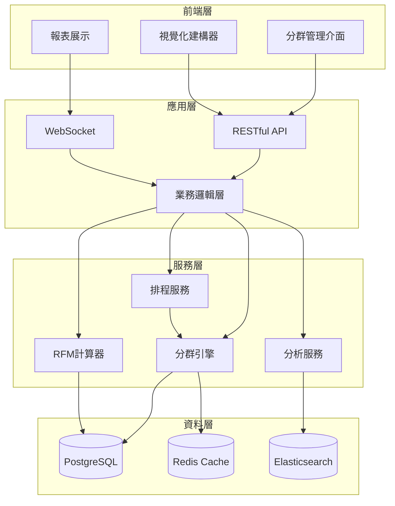

# CRM-CS 客戶分群 (Customer Segmentation) PRD

## 文件資訊
- **版本**: v1.0.0
- **最後更新**: 2025-08-24
- **狀態**: 🔴 未開始
- **負責人**: 待指派

## 1. 功能概述

### 1.1 目的
建立智慧化客戶分群系統，根據多維度數據自動將客戶分類，支援精準行銷、差異化定價和個性化服務。

### 1.2 範圍
- 自動化客戶分群引擎
- 多維度分群條件設定
- 動態分群更新機制
- 分群效果分析與優化

### 1.3 關鍵價值
- 提升客戶價值識別準確度 30%
- 增加目標行銷轉換率 25%
- 優化定價策略執行效率 40%

## 2. 功能性需求

### FR-CRM-CS-001: 分群規則定義
**狀態**: 🔴 未開始

#### 需求描述
- **條件/觸發**: 當管理者需要建立新的客戶分群規則時
- **行為**: 系統提供視覺化規則建構器，支援多條件組合
- **資料輸入**: 
  - 分群名稱、描述
  - 條件類型（購買行為、金額、頻率、產品類別等）
  - 邏輯運算（AND/OR/NOT）
  - 閾值設定
- **資料輸出**: 
  - 規則配置 JSON
  - 預估影響客戶數
  - 規則驗證結果
- **UI反應**: 
  - 拖放式規則建構介面
  - 即時預覽符合條件的客戶數量
  - 條件衝突警示
- **例外處理**: 
  - 規則邏輯錯誤提示
  - 無符合客戶警告
  - 規則重複檢測
- **優先級**: P0

#### 驗收標準
```yaml
- 條件: 建立購買金額 > 100000 且最近30天有交易的VIP分群
  預期結果: 系統正確識別並分類符合條件的客戶

- 條件: 設定互斥的分群條件
  預期結果: 系統提示邏輯衝突並建議修正

- 條件: 規則包含10個以上條件組合
  預期結果: 系統在3秒內完成運算並顯示結果
```

### FR-CRM-CS-002: 自動分群執行
**狀態**: 🔴 未開始

#### 需求描述
- **條件/觸發**: 
  - 定時排程（每日/每週/每月）
  - 客戶資料變更事件
  - 手動觸發
- **行為**: 系統自動執行分群運算，更新客戶標籤
- **資料輸入**: 
  - 客戶交易數據
  - 客戶基本資料
  - 歷史行為數據
- **資料輸出**: 
  - 分群結果清單
  - 變動報告（新增/移除/維持）
  - 執行日誌
- **UI反應**: 
  - 執行進度條
  - 分群變動通知
  - 結果統計圖表
- **例外處理**: 
  - 資料不完整跳過處理
  - 運算超時中斷機制
  - 錯誤重試策略
- **優先級**: P0

#### 驗收標準
```yaml
- 條件: 10萬筆客戶資料自動分群
  預期結果: 系統在5分鐘內完成所有運算

- 條件: 分群執行中系統異常中斷
  預期結果: 系統自動恢復並從中斷點繼續執行

- 條件: 客戶同時符合多個分群條件
  預期結果: 依據優先級規則正確分配主要分群
```

### FR-CRM-CS-003: 分群階層管理
**狀態**: 🔴 未開始

#### 需求描述
- **條件/觸發**: 當需要建立多層級客戶分群架構時
- **行為**: 系統支援父子分群關係，實現精細化管理
- **資料輸入**: 
  - 父分群ID
  - 子分群條件（繼承+額外條件）
  - 階層深度限制
- **資料輸出**: 
  - 分群樹狀結構
  - 各層級客戶分布
  - 階層路徑
- **UI反應**: 
  - 樹狀結構視覺化
  - 展開/收合節點
  - 拖放調整階層
- **例外處理**: 
  - 循環引用檢測
  - 階層深度限制（最多5層）
  - 孤立節點處理
- **優先級**: P1

### FR-CRM-CS-004: 分群效果分析
**狀態**: 🔴 未開始

#### 需求描述
- **條件/觸發**: 查看分群效果報表時
- **行為**: 系統計算並展示各分群的業務指標
- **資料輸入**: 
  - 分析時間範圍
  - 指標選擇（營收、訂單數、客單價等）
  - 對比維度
- **資料輸出**: 
  - 分群業績貢獻度
  - 客戶流動分析
  - ROI 計算結果
  - 趨勢預測
- **UI反應**: 
  - 互動式圖表
  - 指標熱力圖
  - 匯出報表功能
- **例外處理**: 
  - 資料不足提示
  - 統計異常值標記
  - 空分群處理
- **優先級**: P1

### FR-CRM-CS-005: RFM 模型整合
**狀態**: 🔴 未開始

#### 需求描述
- **條件/觸發**: 啟用 RFM (Recency, Frequency, Monetary) 分析時
- **行為**: 系統自動計算 RFM 分數並進行客戶分類
- **資料輸入**: 
  - R/F/M 權重設定
  - 分數區間定義
  - 計算週期
- **資料輸出**: 
  - RFM 分數矩陣
  - 客戶分布圖
  - 策略建議
- **UI反應**: 
  - 3D 散點圖展示
  - 分群遷移動畫
  - 策略建議卡片
- **例外處理**: 
  - 新客戶預設分數
  - 異常值處理
  - 資料缺失補值
- **優先級**: P2

## 3. 非功能性需求

### 3.1 效能需求
- **處理能力**: 支援100萬客戶的分群運算
- **響應時間**: 
  - 規則查詢 < 100ms
  - 分群執行 < 10分鐘（10萬筆）
  - 報表生成 < 3秒
- **並發處理**: 支援10個分群規則同時執行

### 3.2 安全需求
- **資料加密**: 客戶敏感資料 AES-256 加密
- **權限控制**: 
  - 規則建立需要管理員權限
  - 分群結果查看依角色授權
  - 審計日誌記錄所有操作
- **資料隱私**: 符合 GDPR 和個資法規範

### 3.3 可用性需求
- **系統可用性**: 99.9% SLA
- **資料備份**: 每日增量備份，每週全量備份
- **災難復原**: RPO < 1小時，RTO < 4小時

## 4. 系統設計

### 4.1 資料模型

```typescript
// 分群規則
interface SegmentRule {
  id: string;
  name: string;
  description: string;
  status: 'active' | 'inactive' | 'draft';
  priority: number;
  
  // 條件定義
  conditions: SegmentCondition[];
  logicalOperator: 'AND' | 'OR';
  
  // 階層關係
  parentSegmentId?: string;
  childSegments?: string[];
  
  // 執行設定
  schedule?: {
    frequency: 'daily' | 'weekly' | 'monthly';
    time: string;
    timezone: string;
  };
  
  // 元數據
  createdBy: string;
  createdAt: Date;
  updatedAt: Date;
  lastExecutedAt?: Date;
}

// 分群條件
interface SegmentCondition {
  id: string;
  field: string; // 欄位名稱
  operator: 'eq' | 'ne' | 'gt' | 'gte' | 'lt' | 'lte' | 'in' | 'between';
  value: any;
  dataType: 'string' | 'number' | 'date' | 'boolean' | 'array';
  
  // 巢狀條件
  subConditions?: SegmentCondition[];
  logicalOperator?: 'AND' | 'OR';
}

// 分群結果
interface SegmentResult {
  id: string;
  segmentRuleId: string;
  executionId: string;
  
  // 客戶清單
  customerIds: string[];
  customerCount: number;
  
  // 執行資訊
  executedAt: Date;
  executionTime: number; // 毫秒
  status: 'success' | 'partial' | 'failed';
  
  // 變動分析
  changes: {
    added: string[];
    removed: string[];
    maintained: string[];
  };
  
  // 統計資料
  statistics: {
    avgOrderValue: number;
    totalRevenue: number;
    orderCount: number;
    churnRate: number;
  };
}

// RFM 模型
interface RFMModel {
  id: string;
  customerId: string;
  
  // RFM 分數
  recencyScore: number;     // 1-5
  frequencyScore: number;    // 1-5
  monetaryScore: number;     // 1-5
  
  // 原始數據
  lastPurchaseDate: Date;
  purchaseCount: number;
  totalSpent: number;
  
  // 分群結果
  segment: 'Champions' | 'Loyal' | 'Potential' | 'New' | 'At Risk' | 'Lost';
  
  calculatedAt: Date;
}

// 分群效果分析
interface SegmentAnalytics {
  segmentId: string;
  period: {
    start: Date;
    end: Date;
  };
  
  // 業務指標
  metrics: {
    revenue: number;
    orderCount: number;
    customerCount: number;
    avgOrderValue: number;
    conversionRate: number;
    retentionRate: number;
  };
  
  // 比較分析
  comparison: {
    previousPeriod: number; // 變化百分比
    benchmark: number;      // 對比基準
    ranking: number;        // 在所有分群中排名
  };
  
  // 趨勢數據
  trends: Array<{
    date: Date;
    value: number;
    metric: string;
  }>;
}
```

### 4.2 API 設計

```typescript
// 分群規則 API
interface SegmentRuleAPI {
  // 建立規則
  POST   /api/segments/rules
  
  // 查詢規則
  GET    /api/segments/rules
  GET    /api/segments/rules/:id
  
  // 更新規則
  PUT    /api/segments/rules/:id
  
  // 刪除規則
  DELETE /api/segments/rules/:id
  
  // 執行分群
  POST   /api/segments/rules/:id/execute
  
  // 預覽結果
  POST   /api/segments/rules/preview
}

// 分群結果 API
interface SegmentResultAPI {
  // 查詢結果
  GET    /api/segments/results
  GET    /api/segments/results/:id
  
  // 客戶清單
  GET    /api/segments/results/:id/customers
  
  // 匯出結果
  POST   /api/segments/results/:id/export
}

// 分析報表 API
interface SegmentAnalyticsAPI {
  // 效果分析
  GET    /api/segments/analytics/:segmentId
  
  // RFM 分析
  GET    /api/segments/rfm
  POST   /api/segments/rfm/calculate
  
  // 趨勢分析
  GET    /api/segments/trends/:segmentId
}
```

### 4.3 系統架構圖



## 5. 整合需求

### 5.1 系統整合
- **CRM-CM**: 讀取客戶主檔資料
- **OM**: 獲取訂單歷史數據
- **FA-AR**: 取得應收帳款資訊
- **BI**: 提供分析數據源

### 5.2 外部整合
- **行銷自動化平台**: 同步分群結果
- **電子郵件服務**: 發送分群通知
- **數據分析工具**: 匯出分析數據

## 6. 測試需求

### 6.1 單元測試
- 規則邏輯驗證
- 條件運算正確性
- RFM 計算準確性

### 6.2 整合測試
- 跨模組資料同步
- API 端到端測試
- 排程執行測試

### 6.3 效能測試
- 大量資料分群測試（100萬筆）
- 並發執行壓力測試
- 記憶體使用優化測試

### 6.4 驗收測試
- 業務場景模擬
- 使用者操作流程
- 報表準確性驗證

## 7. 部署需求

### 7.1 環境需求
- **開發環境**: Node.js 18+, PostgreSQL 14+
- **測試環境**: 與生產環境相同配置
- **生產環境**: 
  - 應用伺服器: 4 vCPU, 16GB RAM
  - 資料庫伺服器: 8 vCPU, 32GB RAM
  - Redis: 4GB RAM

### 7.2 部署策略
- 藍綠部署
- 功能開關控制
- 漸進式發布

## 8. 維運需求

### 8.1 監控指標
- 分群執行成功率
- 平均執行時間
- 資源使用率
- API 回應時間

### 8.2 日誌管理
- 應用日誌: INFO 級別
- 錯誤日誌: ERROR 級別
- 審計日誌: 所有操作
- 日誌保留: 90天

### 8.3 備份策略
- 資料庫: 每日備份，保留30天
- 設定檔: 版本控制
- 日誌檔: 壓縮歸檔

## 9. 風險評估

### 9.1 技術風險
- **風險**: 大量資料運算效能瓶頸
- **緩解**: 採用分批處理和快取機制

### 9.2 業務風險
- **風險**: 分群規則錯誤影響業務決策
- **緩解**: 建立審核機制和測試環境驗證

### 9.3 安全風險
- **風險**: 客戶資料外洩
- **緩解**: 加密存儲和存取控制

## 10. 相關文件

- [CRM 模組總體設計](../README.md)
- [客戶主檔 PRD](../02.1-CRM-CM-Customer_Management/prd.md)
- [定價管理 PRD](../02.3-CRM-PM-Pricing_Management/prd.md)

## 11. 變更記錄

| 版本 | 日期 | 變更內容 | 作者 |
|------|------|----------|------|
| v1.0.0 | 2025-08-24 | 初始版本 | ERP Team |

---

**文件狀態**: 草稿
**下次審查**: 2025-08-31