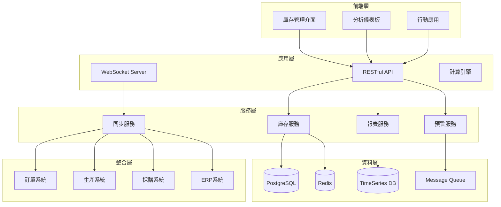

# WMS-IOD 庫存概況/明細 (Inventory Overview/Details) PRD

## 文件資訊
- **版本**: v2.0.0
- **最後更新**: 2025-08-25
- **狀態**: ⚪ 規劃中
- **負責人**: 待指派
- **相關模組**: OM (訂單), MES (生產), PM (採購)

## 1. 功能概述

### 1.1 目的
提供即時、準確的庫存資訊管理系統，支援多倉庫、多據點的庫存查詢、追蹤、分析，確保供應鏈效率最佳化。

### 1.2 範圍
- 即時庫存查詢與監控
- 多維度庫存分析
- 庫存預警與異常管理
- 批號與效期追蹤
- 庫存週轉率分析

### 1.3 關鍵價值
- 降低庫存成本 25%
- 提升庫存準確率至 99.5%
- 減少缺貨率 40%
- 加快庫存週轉 30%

## 2. 功能性需求

### FR-WMS-IOD-001: 即時庫存查詢
**狀態**: 🔴 未開始
**優先級**: P0

#### 需求描述
- **條件/觸發**: 用戶查詢庫存資訊時
- **行為**: 系統提供多維度即時庫存查詢，支援複雜篩選條件
- **資料輸入**: 
  - 查詢條件（品項、倉庫、批號、狀態等）
  - 顯示選項（庫存層級、時間範圍）
  - 排序與分組設定
- **資料輸出**: 
  - 即時庫存數量（可用/預留/在途/凍結）
  - 庫存分布（倉庫/儲位）
  - 批號明細
  - 效期資訊
  - 最後異動記錄
- **UI反應**: 
  - 即時數據更新（WebSocket）
  - 庫存狀態色彩標示
  - 多層級展開檢視
  - 快速篩選工具列
- **例外處理**: 
  - 查無資料提示
  - 權限不足限制顯示
  - 網路斷線快取機制
- **效能要求**: 查詢回應 < 500ms

#### 驗收標準
```yaml
- 條件: 查詢單一品項跨10個倉庫的庫存
  預期結果: 0.5秒內顯示所有倉庫的即時庫存狀態

- 條件: 查詢即將到期（30天內）的所有批號
  預期結果: 列出所有相關批號並依到期日排序

- 條件: 多用戶同時查詢相同品項
  預期結果: 所有用戶看到一致的庫存數據
```

### FR-WMS-IOD-002: 庫存分析儀表板
**狀態**: 🔴 未開始
**優先級**: P0

#### 需求描述
- **條件/觸發**: 進入庫存管理首頁或定時更新
- **行為**: 顯示關鍵庫存指標的視覺化儀表板
- **資料輸入**: 
  - 分析維度（時間、類別、倉庫）
  - 指標選擇
  - 比較基準
- **資料輸出**: 
  - 庫存總值與趨勢
  - ABC分類分析
  - 庫存週轉率
  - 缺貨/過剩清單
  - 庫齡分析
  - Top 10 異動品項
- **UI反應**: 
  - 互動式圖表（可點擊深入）
  - 即時數據重新整理
  - 自訂儀表板配置
  - 匯出報表功能
- **例外處理**: 
  - 資料不足時顯示說明
  - 計算錯誤自動修正
  - 歷史資料缺失處理

#### 驗收標準
```yaml
- 條件: 查看月度庫存週轉率趨勢
  預期結果: 顯示過去12個月的週轉率變化圖表

- 條件: ABC分類分析
  預期結果: 自動將品項分為A(20%)、B(30%)、C(50%)類

- 條件: 設定自訂KPI儀表板
  預期結果: 保存用戶配置，下次登入自動載入
```

### FR-WMS-IOD-003: 庫存預警管理
**狀態**: 🔴 未開始
**優先級**: P0

#### 需求描述
- **條件/觸發**: 
  - 庫存低於安全存量
  - 庫存超過最大存量
  - 批號即將到期
  - 呆滯料超過設定天數
- **行為**: 系統自動監控並發送預警通知
- **資料輸入**: 
  - 預警規則設定
  - 通知對象與方式
  - 預警閾值
  - 檢查頻率
- **資料輸出**: 
  - 預警清單
  - 建議處理方案
  - 預警歷史記錄
  - 處理狀態追蹤
- **UI反應**: 
  - 彈出通知
  - 預警標記（紅黃綠燈）
  - 預警統計面板
  - 一鍵處理功能
- **例外處理**: 
  - 重複預警合併
  - 誤報自動排除
  - 預警升級機制

#### 預警類型定義
```typescript
enum AlertType {
  LOW_STOCK = 'low_stock',           // 低庫存
  OVERSTOCK = 'overstock',           // 過剩庫存
  EXPIRING = 'expiring',             // 即將到期
  EXPIRED = 'expired',               // 已過期
  SLOW_MOVING = 'slow_moving',       // 呆滯料
  DISCREPANCY = 'discrepancy',       // 帳實不符
  ABNORMAL = 'abnormal'              // 異常變動
}
```

### FR-WMS-IOD-004: 批號與效期管理
**狀態**: 🔴 未開始
**優先級**: P1

#### 需求描述
- **條件/觸發**: 需要追蹤批號或管理效期商品時
- **行為**: 提供完整的批號生命週期管理和效期追蹤
- **資料輸入**: 
  - 批號資訊（生產日期、效期、供應商）
  - FIFO/FEFO規則設定
  - 效期預警天數
- **資料輸出**: 
  - 批號族譜（來源追溯）
  - 效期日曆視圖
  - 批號使用記錄
  - 過期處理建議
- **UI反應**: 
  - 批號時間軸顯示
  - 效期顏色標示
  - 批號快速搜尋
  - 掃碼查詢支援
- **例外處理**: 
  - 批號重複檢測
  - 效期邏輯驗證
  - 追溯斷鏈處理

### FR-WMS-IOD-005: 庫存盤點支援
**狀態**: 🔴 未開始
**優先級**: P1

#### 需求描述
- **條件/觸發**: 執行定期或臨時盤點作業時
- **行為**: 支援多種盤點模式，自動產生盤點差異分析
- **資料輸入**: 
  - 盤點計畫（範圍、時間、人員）
  - 實際盤點數量
  - 差異原因說明
  - 調整審批
- **資料輸出**: 
  - 盤點工作單
  - 差異報告
  - 調整單據
  - 盤點績效分析
- **UI反應**: 
  - 盤點進度顯示
  - 差異即時計算
  - 行動裝置支援
  - 語音輸入功能
- **例外處理**: 
  - 盤點中斷恢復
  - 重複盤點防止
  - 差異異常提醒

### FR-WMS-IOD-006: 庫存報表中心
**狀態**: 🔴 未開始
**優先級**: P2

#### 需求描述
- **條件/觸發**: 需要生成各類庫存報表時
- **行為**: 提供標準化和自訂的庫存報表生成功能
- **資料輸入**: 
  - 報表類型選擇
  - 參數設定（日期、範圍、條件）
  - 輸出格式（Excel/PDF/CSV）
  - 排程設定
- **資料輸出**: 
  - 庫存月報/週報/日報
  - 呆滯料分析報表
  - 庫齡分析報表
  - 週轉率報表
  - 異動明細表
- **UI反應**: 
  - 報表模板管理
  - 預覽功能
  - 批次生成
  - 郵件發送
- **例外處理**: 
  - 大量資料分批處理
  - 報表生成失敗重試
  - 格式轉換錯誤處理

## 3. 非功能性需求

### 3.1 效能需求
- **查詢效能**: 
  - 單品查詢 < 200ms
  - 批量查詢 < 2s（1000筆）
  - 報表生成 < 30s
- **並發支援**: 200個同時查詢
- **資料量**: 支援千萬級庫存記錄

### 3.2 準確性需求
- **庫存準確率**: ≥ 99.5%
- **即時性**: 異動後1秒內更新
- **資料一致性**: 強一致性保證

### 3.3 安全需求
- **權限控制**: 基於角色的存取控制
- **資料加密**: 敏感資料加密存儲
- **審計追蹤**: 完整操作日誌

## 4. 系統設計

### 4.1 資料模型

```typescript
// 庫存主檔
interface Inventory {
  id: string;
  itemId: string;
  itemCode: string;
  itemName: string;
  warehouseId: string;
  locationId?: string;
  
  // 數量資訊
  quantity: {
    onHand: number;        // 現有庫存
    available: number;     // 可用庫存
    reserved: number;      // 預留數量
    inTransit: number;     // 在途數量
    frozen: number;        // 凍結數量
    damaged: number;       // 損壞數量
  };
  
  // 批號資訊
  batchNo?: string;
  lotNo?: string;
  serialNo?: string;
  
  // 日期資訊
  productionDate?: Date;
  expiryDate?: Date;
  receivedDate: Date;
  lastMovementDate: Date;
  
  // 成本資訊
  unitCost: number;
  totalValue: number;
  currency: string;
  
  // 供應商資訊
  supplierId?: string;
  purchaseOrderNo?: string;
  
  // 品質資訊
  qualityStatus: 'passed' | 'pending' | 'failed' | 'quarantine';
  qualityCertNo?: string;
  
  // 儲位資訊
  location: {
    zone: string;
    rack: string;
    shelf: string;
    bin: string;
  };
  
  // 系統資訊
  status: InventoryStatus;
  createdAt: Date;
  updatedAt: Date;
  version: number;
}

// 庫存異動記錄
interface InventoryMovement {
  id: string;
  movementNo: string;
  movementType: MovementType;
  movementDate: Date;
  
  // 品項資訊
  itemId: string;
  batchNo?: string;
  
  // 異動資訊
  fromWarehouse?: string;
  toWarehouse?: string;
  fromLocation?: string;
  toLocation?: string;
  
  // 數量資訊
  quantity: number;
  beforeQty: number;
  afterQty: number;
  unit: string;
  
  // 關聯單據
  referenceType: 'purchase' | 'sales' | 'transfer' | 'adjustment' | 'production';
  referenceNo: string;
  
  // 原因說明
  reason?: string;
  remarks?: string;
  
  // 操作資訊
  operatedBy: string;
  approvedBy?: string;
  createdAt: Date;
}

// 庫存預警規則
interface InventoryAlert {
  id: string;
  alertName: string;
  alertType: AlertType;
  status: 'active' | 'inactive';
  
  // 觸發條件
  conditions: {
    itemIds?: string[];
    categories?: string[];
    warehouses?: string[];
    threshold?: {
      type: 'quantity' | 'percentage' | 'days';
      operator: 'gt' | 'gte' | 'lt' | 'lte' | 'eq';
      value: number;
    };
  };
  
  // 通知設定
  notification: {
    channels: ('email' | 'sms' | 'system' | 'webhook')[];
    recipients: string[];
    frequency: 'immediate' | 'daily' | 'weekly';
    template: string;
  };
  
  // 執行記錄
  lastTriggeredAt?: Date;
  triggerCount: number;
  
  createdBy: string;
  createdAt: Date;
  updatedAt: Date;
}

// 盤點單
interface StockCount {
  id: string;
  countNo: string;
  countType: 'full' | 'cycle' | 'spot';
  status: 'planned' | 'in_progress' | 'completed' | 'cancelled';
  
  // 盤點範圍
  scope: {
    warehouses: string[];
    categories?: string[];
    items?: string[];
    locations?: string[];
  };
  
  // 盤點時間
  plannedDate: Date;
  startedAt?: Date;
  completedAt?: Date;
  
  // 盤點結果
  summary: {
    totalItems: number;
    countedItems: number;
    matchedItems: number;
    discrepancyItems: number;
    totalVariance: number;
    varianceValue: number;
  };
  
  // 盤點明細
  details: StockCountDetail[];
  
  // 審批資訊
  countedBy: string[];
  reviewedBy?: string;
  approvedBy?: string;
  approvalStatus?: 'pending' | 'approved' | 'rejected';
  
  createdAt: Date;
  updatedAt: Date;
}

// 盤點明細
interface StockCountDetail {
  id: string;
  countId: string;
  itemId: string;
  batchNo?: string;
  locationId: string;
  
  // 數量資訊
  systemQty: number;
  countedQty: number;
  variance: number;
  varianceRate: number;
  
  // 差異處理
  adjustmentQty?: number;
  adjustmentReason?: string;
  adjustmentStatus?: 'pending' | 'approved' | 'rejected';
  
  // 盤點資訊
  countedAt: Date;
  countedBy: string;
  remarks?: string;
}

// 庫存分析指標
interface InventoryMetrics {
  date: Date;
  warehouseId?: string;
  
  // 庫存指標
  totalValue: number;
  totalItems: number;
  totalSKUs: number;
  
  // 週轉指標
  turnoverRate: number;
  turnoverDays: number;
  stockoutRate: number;
  overstockRate: number;
  
  // ABC分析
  abcAnalysis: {
    A: { items: number; value: number; percentage: number };
    B: { items: number; value: number; percentage: number };
    C: { items: number; value: number; percentage: number };
  };
  
  // 庫齡分析
  agingAnalysis: {
    '0-30': number;
    '31-60': number;
    '61-90': number;
    '91-180': number;
    '180+': number;
  };
  
  // 效率指標
  accuracy: number;
  fillRate: number;
  cycleTime: number;
}
```

### 4.2 API 設計

```typescript
// 庫存查詢 API
interface InventoryAPI {
  // 查詢庫存
  GET    /api/inventory
  GET    /api/inventory/:id
  GET    /api/inventory/item/:itemId
  
  // 批號查詢
  GET    /api/inventory/batch/:batchNo
  GET    /api/inventory/expiring
  
  // 庫存異動
  POST   /api/inventory/movement
  GET    /api/inventory/movements
  
  // 庫存調整
  POST   /api/inventory/adjustment
  
  // 庫存轉移
  POST   /api/inventory/transfer
}

// 分析報表 API
interface AnalyticsAPI {
  // 儀表板
  GET    /api/inventory/dashboard
  
  // 分析報表
  GET    /api/inventory/analytics/abc
  GET    /api/inventory/analytics/aging
  GET    /api/inventory/analytics/turnover
  
  // 預警管理
  GET    /api/inventory/alerts
  POST   /api/inventory/alerts
  PUT    /api/inventory/alerts/:id
  
  // 報表生成
  POST   /api/inventory/reports/generate
  GET    /api/inventory/reports/:id
}

// 盤點管理 API
interface StockCountAPI {
  // 盤點計畫
  POST   /api/stockcount
  GET    /api/stockcount/:id
  
  // 盤點執行
  POST   /api/stockcount/:id/start
  PUT    /api/stockcount/:id/count
  POST   /api/stockcount/:id/complete
  
  // 差異處理
  GET    /api/stockcount/:id/variances
  POST   /api/stockcount/:id/adjust
}

// WebSocket 事件
interface InventoryWebSocketEvents {
  // 庫存更新
  'inventory:updated': (data: {
    itemId: string;
    warehouseId: string;
    quantity: number;
    movement: any;
  }) => void;
  
  // 預警觸發
  'alert:triggered': (alert: InventoryAlert) => void;
  
  // 盤點進度
  'stockcount:progress': (progress: {
    countId: string;
    percentage: number;
    status: string;
  }) => void;
}
```

### 4.3 系統架構圖



## 5. 整合需求

### 5.1 內部系統整合
- **OM-OL**: 訂單預留庫存
- **OM-COSR**: 訂單扣減庫存
- **MES-PSWO**: 生產領料與入庫
- **PM-PODM**: 採購入庫
- **FA-AR**: 庫存成本核算

### 5.2 外部系統整合
- **條碼系統**: 掃碼出入庫
- **RFID系統**: 自動盤點
- **WMS設備**: 自動倉儲
- **IoT感測器**: 環境監控

## 6. 測試需求

### 6.1 功能測試
```typescript
describe('庫存查詢功能', () => {
  test('應正確返回即時庫存數據', async () => {
    // 測試即時查詢
  });
  
  test('應正確計算可用庫存', async () => {
    // 測試可用庫存 = 現有 - 預留 - 凍結
  });
  
  test('應支援批號追溯', async () => {
    // 測試批號查詢
  });
});
```

### 6.2 效能測試
- 10萬SKU查詢測試
- 並發200用戶壓力測試
- 報表生成效能測試

### 6.3 準確性測試
- 庫存計算準確性
- 併發異動一致性
- 盤點差異計算

## 7. 實施計劃

### 7.1 開發階段
1. **Phase 1** (Week 1-2): 基礎查詢功能
2. **Phase 2** (Week 3-4): 預警與分析
3. **Phase 3** (Week 5-6): 盤點功能
4. **Phase 4** (Week 7-8): 報表與整合

### 7.2 關鍵里程碑
- M1: 基礎功能上線
- M2: 預警系統啟用
- M3: 全面整合完成
- M4: 效能優化完成

## 8. 風險評估

| 風險項目 | 影響 | 機率 | 緩解措施 |
|---------|------|------|----------|
| 資料遷移複雜 | 高 | 中 | 分批遷移，建立回滾機制 |
| 即時性要求高 | 高 | 高 | 採用快取和消息隊列 |
| 整合點眾多 | 中 | 高 | 標準化介面，分階段整合 |

## 9. 成功指標

### 9.1 業務指標
- 庫存準確率 ≥ 99.5%
- 庫存週轉率提升 30%
- 缺貨率降低 40%
- 呆滯料減少 50%

### 9.2 系統指標
- 查詢響應時間 < 500ms
- 系統可用性 ≥ 99.9%
- 資料完整性 100%
- 用戶滿意度 ≥ 85%

## 10. 相關文件

- [WMS 總體架構](../README.md)
- [批號管理 PRD](../08.3-WMS-BTM-Batch_Traceability/prd.md)
- [庫存調整 PRD](../08.4-WMS-IAT-Inventory_Adjustment/prd.md)
- [API 規範文件](../../docs/api/wms-api.md)

## 11. 變更記錄

| 版本 | 日期 | 變更內容 | 作者 |
|------|------|----------|------|
| v1.0.0 | 2025-08-22 | 初始版本 | ERP Team |
| v2.0.0 | 2025-08-25 | 新增即時更新、預警管理、盤點功能 | ERP Team |

---

**文件狀態**: 規劃中
**下次審查**: 2025-09-01
**聯絡人**: wms@tsaitung.com