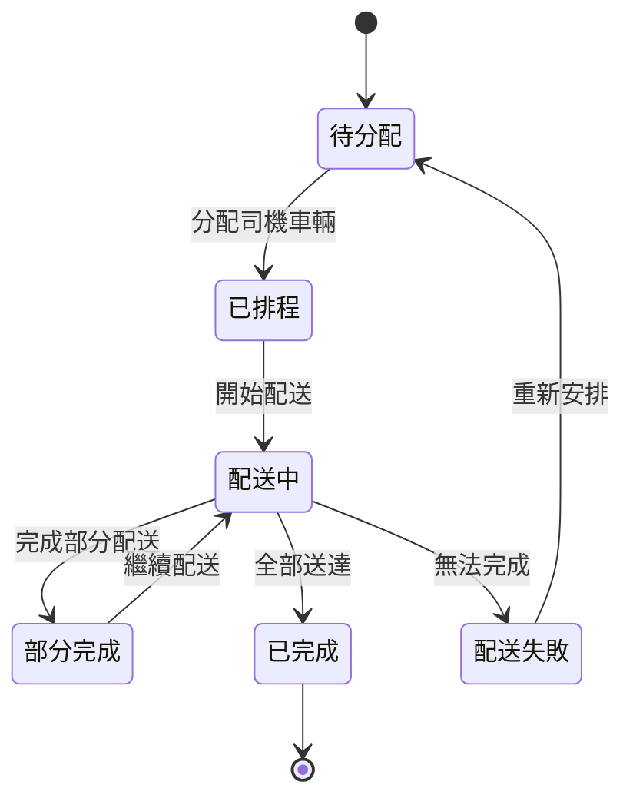

# 🚚 配送車輛管理 PRD (Delivery & Vehicle Management)

**模組代碼**: LM-DVM  
**父模組**: LM (Logistics Management)  
**版本**: v1.0.0  
**最後更新**: 2025-08-22

## 📋 模組概述

配送車輛管理模組負責管理物流配送作業，包括司機管理、車輛調度、路線規劃、配送追蹤等功能，確保貨物準時、安全地送達客戶手中。

### 業務價值
- 優化配送路線，降低運輸成本
- 即時追蹤配送狀態，提升客戶滿意度
- 合理調度車輛資源，提高使用效率
- 自動化配送排程，減少人工作業

### 關鍵指標
- 準時交貨率 > 95%
- 車輛使用率 > 80%
- 配送成本降低 15%
- 客戶滿意度 > 4.5/5

## 🎯 功能需求

### FR-LM-DVM-001: 司機基本資料管理 🔴

管理司機個人資料、證照、排班等資訊。

**需求細節**：
- **條件/觸發**: 
  - 使用者進入司機管理介面
  - 需要新增/編輯司機資料
  - 司機證照即將到期
  
- **行為**:
  - 提供司機資料的CRUD操作
  - 自動檢查證照有效期
  - 支援司機排班管理
  - 記錄司機績效評分
  
- **資料輸入**:
  ```typescript
  interface DriverInput {
    driverCode: string;
    name: string;
    phone: string;
    licenseNumber: string;
    licenseExpiry: Date;
    vehicleTypes: string[];
    status: 'active' | 'inactive' | 'on_leave';
    emergencyContact?: {
      name: string;
      phone: string;
      relationship: string;
    };
  }
  ```
  
- **資料輸出**:
  ```typescript
  interface DriverProfile {
    id: string;
    driverCode: string;
    name: string;
    phone: string;
    licenseInfo: {
      number: string;
      expiryDate: Date;
      daysUntilExpiry: number;
      isValid: boolean;
    };
    performanceScore: number;
    totalDeliveries: number;
    currentStatus: string;
    nextSchedule?: DeliverySchedule;
  }
  ```
  
- **UI反應**:
  - 司機清單表格顯示
  - 證照到期提醒標示
  - 司機狀態即時更新
  - 績效評分視覺化顯示
  
- **例外處理**:
  - 證照號碼重複檢查
  - 證照過期警告
  - 必填欄位驗證
  - 聯絡電話格式驗證
  
- **優先級**: P0 (核心功能)

**驗收標準**：
```yaml
scenarios:
  - given: 使用者在司機管理介面
    when: 輸入新司機資料並提交
    then: 
      - 系統驗證資料完整性
      - 建立司機檔案
      - 發送歡迎通知
    
  - given: 司機證照30天內到期
    when: 系統進行每日檢查
    then:
      - 標記警告狀態
      - 發送更新提醒
      - 通知管理員
```

### FR-LM-DVM-002: 車輛資源管理 🔴

管理配送車輛資訊、維護記錄、使用狀態。

**需求細節**：
- **條件/觸發**: 
  - 車輛登記/報廢
  - 維護保養到期
  - 車輛調度需求
  
- **行為**:
  - 車輛基本資料維護
  - 維護保養排程追蹤
  - 車輛使用狀態監控
  - 油耗/里程統計
  
- **資料輸入**:
  ```typescript
  interface VehicleInput {
    plateNumber: string;
    vehicleType: 'truck' | 'van' | 'motorcycle';
    brand: string;
    model: string;
    year: number;
    capacity: {
      weight: number; // kg
      volume: number; // m³
    };
    fuelType: string;
    nextMaintenanceDate: Date;
    insuranceExpiry: Date;
  }
  ```
  
- **資料輸出**:
  ```typescript
  interface VehicleStatus {
    id: string;
    plateNumber: string;
    currentStatus: 'available' | 'in_use' | 'maintenance' | 'broken';
    currentDriver?: string;
    currentRoute?: string;
    location?: GPSLocation;
    mileage: number;
    fuelLevel: number;
    maintenanceAlert: boolean;
    utilizationRate: number;
  }
  ```
  
- **UI反應**:
  - 車輛狀態儀表板
  - 維護提醒通知
  - 使用率圖表顯示
  - 地圖定位顯示
  
- **例外處理**:
  - 車牌號碼唯一性檢查
  - 保險/維護過期警告
  - 超載警告
  - 車輛故障處理
  
- **優先級**: P0 (核心功能)

**驗收標準**：
```yaml
scenarios:
  - given: 新車輛需要登記
    when: 輸入車輛資訊
    then:
      - 驗證車牌唯一性
      - 建立車輛檔案
      - 設定維護排程
    
  - given: 車輛維護到期前7天
    when: 系統檢查
    then:
      - 發送維護提醒
      - 更新車輛狀態
      - 通知車隊管理員
```

### FR-LM-DVM-003: 配送路線規劃 🔴

智能規劃最佳配送路線，考慮時間、距離、成本等因素。

**需求細節**：
- **條件/觸發**: 
  - 有待配送訂單
  - 手動建立配送任務
  - 路線優化請求
  
- **行為**:
  - 自動分配訂單到路線
  - 計算最佳配送順序
  - 預估配送時間
  - 考慮交通狀況
  
- **資料輸入**:
  ```typescript
  interface RouteRequest {
    deliveryDate: Date;
    orders: string[];
    vehicleId?: string;
    driverId?: string;
    constraints?: {
      maxStops: number;
      maxDistance: number;
      timeWindow: {
        start: string;
        end: string;
      };
    };
  }
  ```
  
- **資料輸出**:
  ```typescript
  interface DeliveryRoute {
    routeId: string;
    routeCode: string;
    vehicleId: string;
    driverId: string;
    stops: Array<{
      sequence: number;
      orderId: string;
      customerName: string;
      address: string;
      estimatedArrival: Date;
      deliveryWindow: TimeWindow;
      packages: number;
      weight: number;
    }>;
    totalDistance: number;
    estimatedDuration: number;
    estimatedCost: number;
    optimizationScore: number;
  }
  ```
  
- **UI反應**:
  - 路線地圖視覺化
  - 拖拽調整順序
  - 時間軸顯示
  - 成本效益分析
  
- **例外處理**:
  - 車輛容量超載
  - 時間窗口衝突
  - 地址無法解析
  - 司機排班衝突
  
- **優先級**: P0 (核心功能)

**驗收標準**：
```yaml
scenarios:
  - given: 有10個待配送訂單
    when: 執行路線規劃
    then:
      - 自動分組配送批次
      - 優化配送順序
      - 分配車輛司機
      - 顯示預估時間成本
    
  - given: 配送路線已規劃
    when: 調整配送順序
    then:
      - 重新計算時間
      - 更新成本預估
      - 檢查時間窗口
```

### FR-LM-DVM-004: 即時配送追蹤 🟡

提供配送過程的即時追蹤與狀態更新。

**需求細節**：
- **條件/觸發**: 
  - 司機開始配送
  - 到達配送點
  - 完成配送
  - 異常事件發生
  
- **行為**:
  - GPS即時定位
  - 配送狀態更新
  - 預計到達時間計算
  - 異常事件記錄
  
- **資料輸入**:
  ```typescript
  interface DeliveryUpdate {
    routeId: string;
    driverId: string;
    location: {
      latitude: number;
      longitude: number;
      timestamp: Date;
    };
    status: 'started' | 'in_transit' | 'arrived' | 'delivered' | 'failed';
    currentStop?: number;
    notes?: string;
    photo?: string;
    signature?: string;
  }
  ```
  
- **資料輸出**:
  ```typescript
  interface DeliveryTracking {
    routeId: string;
    currentStatus: string;
    currentLocation: GPSLocation;
    completedStops: number;
    totalStops: number;
    estimatedCompletion: Date;
    delays: Array<{
      stopId: string;
      reason: string;
      duration: number;
    }>;
    trail: GPSLocation[];
    notifications: Notification[];
  }
  ```
  
- **UI反應**:
  - 地圖即時更新
  - 進度條顯示
  - 延遲警告提示
  - 客戶通知發送
  
- **例外處理**:
  - GPS訊號遺失
  - 配送失敗處理
  - 客戶不在處理
  - 車輛故障處理
  
- **優先級**: P1 (重要功能)

**驗收標準**：
```yaml
scenarios:
  - given: 司機開始配送
    when: 更新配送狀態
    then:
      - 記錄開始時間
      - 啟動GPS追蹤
      - 通知客戶
    
  - given: 配送過程中
    when: 司機到達配送點
    then:
      - 更新當前位置
      - 記錄到達時間
      - 發送到達通知
      - 等待簽收確認
```

### FR-LM-DVM-005: 配送績效分析 🟡

分析配送績效指標，提供改善建議。

**需求細節**：
- **條件/觸發**: 
  - 定期報表生成
  - 績效查詢請求
  - 異常指標觸發
  
- **行為**:
  - 計算關鍵績效指標
  - 生成分析報表
  - 提供改善建議
  - 績效趨勢分析
  
- **資料輸入**:
  ```typescript
  interface PerformanceQuery {
    dateRange: {
      from: Date;
      to: Date;
    };
    metrics: string[];
    groupBy?: 'driver' | 'vehicle' | 'route' | 'customer';
    filters?: {
      driverId?: string;
      vehicleId?: string;
      region?: string;
    };
  }
  ```
  
- **資料輸出**:
  ```typescript
  interface PerformanceReport {
    period: DateRange;
    kpis: {
      onTimeDeliveryRate: number;
      averageDeliveryTime: number;
      costPerDelivery: number;
      vehicleUtilization: number;
      customerSatisfaction: number;
    };
    trends: Array<{
      metric: string;
      values: TimeSeriesData[];
      change: number;
    }>;
    topPerformers: Array<{
      type: string;
      id: string;
      name: string;
      score: number;
    }>;
    recommendations: string[];
  }
  ```
  
- **UI反應**:
  - 儀表板圖表顯示
  - 趨勢線圖呈現
  - 排行榜顯示
  - 建議清單列表
  
- **例外處理**:
  - 資料不足警告
  - 異常數據標記
  - 計算錯誤處理
  
- **優先級**: P2 (次要功能)

**驗收標準**：
```yaml
scenarios:
  - given: 月底績效評估
    when: 生成月度報表
    then:
      - 計算所有KPI
      - 比較上月數據
      - 識別改善機會
      - 生成視覺化報告
    
  - given: 司機績效查詢
    when: 選擇特定司機
    then:
      - 顯示個人績效
      - 對比團隊平均
      - 提供改善建議
```

## 🔄 狀態機



## 📊 資料模型

### 核心實體

```typescript
interface Driver {
  id: string;
  driverCode: string;
  personalInfo: PersonalInfo;
  license: LicenseInfo;
  employment: EmploymentInfo;
  performance: PerformanceMetrics;
  schedule: Schedule[];
  status: DriverStatus;
  createdAt: Date;
  updatedAt: Date;
}

interface Vehicle {
  id: string;
  plateNumber: string;
  vehicleInfo: VehicleInfo;
  capacity: Capacity;
  maintenance: MaintenanceRecord[];
  usage: UsageStatistics;
  currentStatus: VehicleStatus;
  createdAt: Date;
}

interface DeliveryRoute {
  id: string;
  routeCode: string;
  plannedDate: Date;
  vehicle: Vehicle;
  driver: Driver;
  stops: DeliveryStop[];
  statistics: RouteStatistics;
  status: RouteStatus;
  createdAt: Date;
  completedAt?: Date;
}

interface DeliveryStop {
  id: string;
  sequence: number;
  order: Order;
  customer: Customer;
  address: Address;
  timeWindow: TimeWindow;
  actualArrival?: Date;
  actualDeparture?: Date;
  deliveryProof?: DeliveryProof;
  status: StopStatus;
}
```

## 🔗 整合點

### 內部整合
- **OM (訂單管理)**: 獲取待配送訂單
- **WMS (倉存管理)**: 確認出貨準備
- **CRM (客戶管理)**: 獲取配送地址
- **FA (財務會計)**: 配送成本核算

### 外部整合
- **地圖服務**: 路線規劃、導航
- **GPS追蹤**: 即時定位
- **簡訊服務**: 配送通知
- **電子簽名**: 簽收確認

## 📈 關鍵指標

### KPIs
- **準時交貨率**: > 95%
- **平均配送時間**: < 4小時
- **配送成本率**: < 5%
- **車輛使用率**: > 80%
- **客戶滿意度**: > 4.5/5

### 監控指標
- 每日配送量
- 路線完成率
- 異常事件數
- 平均延遲時間
- 油耗效率

## 🔐 安全需求

### 權限控制
- 司機：查看個人路線、更新配送狀態
- 調度員：規劃路線、分配資源
- 主管：查看報表、績效管理
- 系統管理員：完整權限

### 資料保護
- 客戶地址加密儲存
- 簽收資料保護
- GPS軌跡隱私保護
- 司機個資保護

## 📋 非功能需求

### 效能需求
- 路線規劃 < 5秒 (100個配送點)
- GPS更新頻率 < 30秒
- 地圖載入 < 2秒
- 並發追蹤 > 100台車輛

### 可用性需求
- 系統可用性 > 99.5%
- 離線模式支援
- 自動故障轉移
- 資料自動備份

## 🚀 實施計畫

### Phase 1 (Week 1-2)
- [x] 司機基本資料管理
- [x] 車輛資源管理
- [ ] 基礎路線規劃

### Phase 2 (Week 3-4)
- [ ] 進階路線優化
- [ ] 即時GPS追蹤
- [ ] 配送狀態更新

### Phase 3 (Week 5-6)
- [ ] 績效分析報表
- [ ] 客戶通知系統
- [ ] 電子簽收功能

## 📝 備註

### 技術考量
- 使用 Google Maps API 進行路線規劃
- Redis 快取熱門路線資料
- WebSocket 實現即時追蹤
- PostgreSQL PostGIS 儲存地理資料

### 業務規則
- 每台車最多安排20個配送點
- 司機每日工時不超過10小時
- 冷鏈商品優先配送
- 市區配送時間窗口2小時

### 相依性
- 需要 OM 模組完成訂單狀態同步
- 需要地圖服務API金鑰
- 需要簡訊服務設定
- 需要車載GPS設備

---

**文件狀態**: 開發中  
**負責人**: 物流團隊  
**最後審查**: 2025-08-22